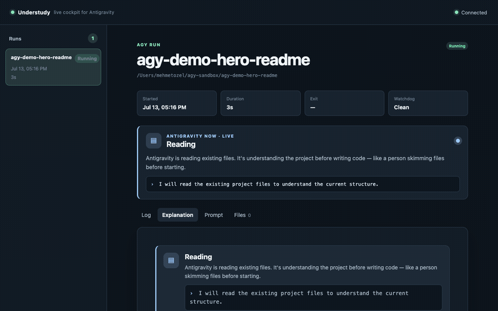

# Understudy

**A live cockpit for the AI coding agents you delegate to Google Antigravity (agy / Gemini).**
Offload the grunt work to a cheap model, watch it work in plain language, and save your
premium model budget for the hard thinking.



## Why

Premium coding-model budgets run out fast, and rate limits bite. Google Antigravity / Gemini
agents are cheap with generous limits — but they run headless and you can't see what they're
doing. Understudy makes delegating to the cheap model **safe and visible**: hand off routine
implementation, watch every step, and keep your premium model for what actually needs it.
Smart routing, not magic.

## Quickstart

```bash
npx agy-understudy
```

Opens a local cockpit at http://127.0.0.1:4288 that lists the Antigravity runs under
`~/agy-sandbox` and streams what each one is doing, live.

Delegate a bounded task to Antigravity and watch it:

```bash
npx agy-understudy run --dir ~/agy-sandbox/my-task --prompt ~/agy-sandbox/my-task/prompt.md
```

## What you see

- A live **activity strip**: reading / exploring / planning / writing code / testing / question / done.
- An **Explanation** tab: a step-by-step timeline plus a "how Antigravity works" primer.
- The prompt it was given and the files it produced.

## Requirements

- [Google Antigravity](https://antigravity.google) CLI (`agy`) on your PATH.
- Node.js ≥ 20.

## Configuration

- `--root <dir>` / `UNDERSTUDY_ROOT` — where runs live (default `~/agy-sandbox`).
- `--port <n>` / `UNDERSTUDY_PORT` — cockpit port (default 4288).

## How it works

Understudy is local-only and read-only. One Node process serves the cockpit UI and a small API
that reads the run directories under your root. The "what is it doing?" explanation is produced
by a deterministic local parser (no LLM, no network). A watchdog protects delegated runs
(6-minute limit, 90-second stall kill).

## License

MIT.
